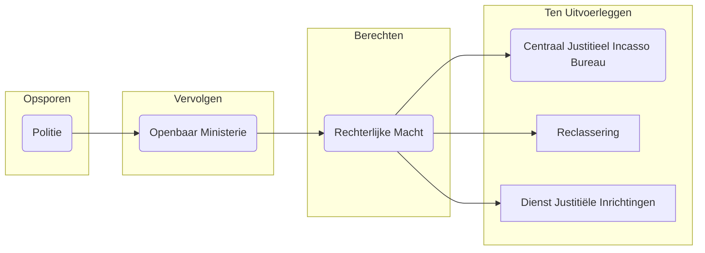

## 1 Criminaliteit en Criminologie
Het kwartet is een hulpmiddel met alles wat voorbijkomt in de criminologie en het tentamen.

### 1.1 Wat is criminaliteit?
"Gedrag dat in strijd is met de wet/norm overschrijdend, en bestraft wordt."

Criminaliteit is **menselijk gedrag** waarbij **andere personen (of dieren of het milieu) worden uitgebuit of schade toegebracht**, en **dat sociale regels schendt**. 

En waarvan in **rechtsnormen** (door de overheid vastgestelde regels/wetten) **is aangegeven dat het niet mag**, en **waarvan de overheid de wetten ook handhaaft**.

>Criminoloog: wanneer word iets "geüpgraded" naar de onderste definitie?

In elke samenleving zijn er gedragingen die meer of minder gewenst worden gevonden. Hierbij wordt vaak onderscheid gemaakt tussen:

**Gebruiken:** minder gewenst & geen/lichte sancties
**Normen:** niet gewenst & (niet wettelijke) sancties
**Rechtsnormen:** niet gewenst & wettelijke sancties (= wetten en jurisprudentie)

**Slecht gedrag (Mala in Se)**
- Gedrag dat door vrijwel iedereen gezien wordt als slecht
- Daarom in bijna alle landen op alle momenten in Wetboeken van Strafrecht opgenomen
- Opgenomen in universele wetten: zie bijv. Grondwet & Rechten van de mens
- Denk aan bijv. moord

**Verboden gedrag (Mala Prohibita)**
- Gedrag waarover verschillende ideeën zijn over of en hoe erg dit slecht is
- Daarom verschillen tussen landen en momenten in of het is opgenomen in Wetboek van Strafrecht
- Niet opgenomen in universele wetten: zie bijv. Grondwet & Rechten van de mens

**Verklaringen voor definities criminaliteit**
- Normen van samenleving (consensus model: ideaal idee dat we allemaal hetzelfde denken over wat strafbaar is of niet)
- Normen en belangen van machthebber (conflict model)
- Politieke besluitvorming (pluralisme model: bijv. Nederland: de wetgever bepaalt)

Cybercrime stond bijv. 50 jaar geleden niet in het WvS. Technologisch veranderd er van alles, maar de maatschappelijke context verandert ook continu. 

**Verschillen tussen landen in definities van criminaliteit**
Er zijn verschillende voorbeelden van zaken die in Nederland legaal zijn maar in het buitenland niet:
- (Soft) drugsgebruik & drugsbezit
- Prostitutie
- Homoseksualiteit

We hebben het in Nederland best wel veel over **(de)criminalisering**. We hebben het er nu over omdat er op 29 oktober verkiezingen zijn, en als je dan gaat stemmen dan breng je een stem uit op een partij die voorkeuren heeft m.b.t. gedragingen die strafbaar moeten worden. 

**Decriminalisering** gaat over gedragingen die vroeger strafbaar waren, maar nu niet meer. Bijvoorbeeld het maken en verkopen van voorbehoedsmiddelen, overspel, homoseksualiteit, echtbreuk en prostitutie. 

**Criminalisering** is gedrag dat nu wel strafbaar is, maar vroeger niet. Denk aan rijden zonder gordel of hacking. In de toekomst zou je bijv. kunnen denken aan "op een Fatbike fietsen zonder helm."

### 1.2 Waarom bestuderen we de criminaliteit?
Criminaliteit is:
- Veelvoorkomend
- Veroorzaakt veel schade
- Is een sociaal probleem
- Is een politiek probleem

Criminaliteit is een maatschappelijk probleem omdat het ==**veelvoorkomend**== is. Er is veel 
1) criminaliteit tegen personen, goederen, overheid en samenleving
2) slachtofferloze criminaliteit (drugshandel, echtscheiding, euthanasie, gokken).

>Slachtofferloos: alleen als alle betrokken partijen vrijwillig instemmen en vinden dat zij door de transactie niet geschaad worden.

Criminaliteit is ook een probleem dat ==**veel schade**== veroorzaakt. Er is veel 
1) materiële schade (voor burgers, bedrijven, overheid en financieel), 
2) milieuschade
3) immateriële schade (leed, angst, morele verontwaardiging, ontwrichting, bedreiging rechtsorde, ondermijning legitimiteit democratische rechtsstaat.)

Daarnaast is het een ==**sociaal probleem**==. Er zijn 
1) Veel betrokken actoren, organisaties, bedrijven, maatschappelijke instellingen. 
2) Er zijn maatschappelijke oorzaken van criminaliteit
3) Verschillende en tegenstrijdige belangen bij aanpak
4) Veel discussies over criminaliteit en de aanpak in publiek debat en media
5) Spanningen tussen wensen burgers en de rol van de overheid

Tot slot is het een ==**politiek probleem**== omdat het zorgen voor de veiligheid een basisfunctie is van de overheid, veiligheid een collectief goed is, het hoog op de publieke en politieke agenda staat en politieke partijen en groeperingen verschillen in voorkeuren voor aanpak van criminaliteit.

### 1.3 Het discipline criminologie
Criminologie is een 'object' wetenschap. Het object is '**criminaliteit en de reacties erop**'. De hoofdvragen van de criminologie zijn:

1. Wat wordt (waarom) verstaan onder criminaliteit?
2. Wat is de aard, omvang en ontwikkeling van criminaliteit?
3. Wat zijn de achtergronden/verklaringen voor (verschillen in) criminaliteit
4. Wat is de wijze waarop de overheid en de overige maatschappij op criminaliteit reageert?

Criminologie wordt bestudeerd vanuit meerdere disciplines, bijvoorbeeld door middel van de **maatschappijwetenschappen** (sociologie, economie, geografie, antropologie), **gedragswetenschappen** (psychologie, biologie, medische wetenschappen), **natuurwetenschappen** (criminalistiek, natuurkunde, scheikunde) en **juridische wetenschappen** (strafrecht). Criminologie is een theoretisch empirische wetenschap. 

#### 1.3.1 Sub-disciplines van de criminologie
Belangrijke sub-disciplines van de criminologie zijn o.a.:

- Criminografie: de beschrijvende studie van de aard, omvang en ontwikkeling van criminaliteit
- Etiologie: de verklarende studie van de oorzaken/verklaringen van criminaliteit
- Penologie: de studie van de formele (straffen) en informele reacties op criminaliteit
- Criminaliteitspreventie
- Victimologie: de studie van slachtoffers en criminaliteit

### 1.4 De werkwijze van criminologie
Criminologen stellen verschillende soorten vragen, o.a.:

- Beschrijvingsvragen
	Over aard, omvang, verschillen en ontwikkelingen. Bijvoorbeeld: hoeveel criminaliteit is er, in hoeverre is criminaliteit gestegen/gedaald
- Verklaringsvragen
	Waarom....?
- Toetsingsvragen
	In hoeverre klopt de hypothese/verwachting dat...?
- Beleidsvragen
	Hoe kan het probleem worden opgelost?

Vragen kunnen betrekking hebben op verschillende **eenheden**:
- Onwenselijk gedrag/delicten
- Daders
- Slachtoffers
- Buurten, steden, landen, perioden
- Actoren bij preventie en strafrechtspleging

De criminologie is een wetenschappelijke discipline waarin feiten, verklarende theorieën, patronen en beleid op basis van wetenschappelijke inzichten centraal staan.

#### 1.4.1 Grondregels voor criminologisch onderzoek
Denk aan het **PTOB**-schema. Dit wordt ook wel de **empirische cyclus** genoemd.

1. Formuleer **p**robleemstellingen en (onderzoeks)vragen
2. Bedenk en formuleer **t**heorieën/verklaringen
3. Verricht **o**nderzoek in de empirie (beschrijvend en toetsend)
4. Ondersteun **b**eleid (alleen) op basis van uitkomsten onderzoek

---
## 2 Beschrijvende Criminologie
De hoofdvragen van de criminologie zijn: 
1. Wat wordt (waarom) verstaan onder criminaliteit? 
2. Wat is aard, omvang en ontwikkeling van criminaliteit? 
3. Wat zijn de achtergronden/verklaringen voor (verschillen in) criminaliteit? 
4. Wat is de wijze waarop de overheid en de overige maatschappij op criminaliteit reageert?

### 2.1 Interviews en enquêtes
Hoe kunnen we meten hoeveel criminaliteit er in Nederland is? 
#### 2.1.1 Interviews
Bij een interview, interview je personen. Dit is een veelgebruikte onderzoeksmethode in de criminologie. Interviews kunnen schriftelijk of mondeling. Dit kan bijvoorbeeld met:

- Semi- en ongestructureerde kleinschalige(re) studies
- Life histories
- Gestructureerde grootschalige enquêtes

>Longitudinaal onderzoek = onderzoek met meerdere meetmomenten

Dit lijkt heel simpel: het lijkt heel logisch om enquêtes te houden. Toch bestaat dit nog niet zo lang. Daarvoor, als criminologen, werd er gebruik gemaakt van geregistreerde data. Het is belangrijk om te weten dat deze gegevens er dus niet zijn als je historisch onderzoek is. 

**Voordelen van interviews en enquêtes**
- Inzicht in delicten die niet in officiële registraties zijn opgenomen (**dark number**)
	Dark number is zeer belangrijk voor de criminoloog (!)
- Geen last van verschillen in definities en wet-regelgeving
- Vaak gegevens bekend over kenmerken van daders en slachtoffers
- Vaak beleving van criminaliteit bekend

**Nadelen van interviews en enquêtes**
- Representativiteit niet altijd voldoende
- Antwoorden soms niet betrouwbaar of valide
	- Door verschillen in definities van delict
	- Door problemen van herinnering (telescoping)
	- Door schaamte of stoer doen
	- Door vraagformulering en volgorde vragen
- Sommige delicten blijven buiten zicht
	- Slachtofferloze delicten
	- Weinig voorkomende delicten
	- Dodelijk geweld
- Veel moeite om uit te voeren

#### 2.1.2 Slachtofferenquêtes
>Dit zijn enquêtes onder de **gehele bevolking** waarin mensen worden gevraagd of ze slachtoffer zijn geworden. Het is **niet** een enquête onder slachtoffers.

Deze enquêtes zijn grootschalige onderzoeken waarbij een groep burgers (de populatie) op gestructureerde wijze gevraagd wordt over …

- Slachtofferschap van (bepaalde vormen van) criminaliteit (prevalentie en frequentie)
- Ervaringen met en beleving van het delict
- Contacten met actoren in de strafrechtsketen
- Kenmerken van de ondervraagde, bijv.
	- Persoonskenmerken
	- Preventiemaatregelen

**Prevalentie**: Ben je wel of geen slachtoffer geweest? (%)
**Frequentie**: Hoe vaak? (per bv 100.000 inwoners)

>Het is belangrijk, bij het bekijken van resultaten, dat je je bewust bent of het gaat om prevalentie of frequentie. Iemand kan namelijk meerdere keren slachtoffer zijn geweest. 

![[Pasted image 20250915173937.png|Je ziet een halvering in 2017 t.o.v. 2005. ]]

Nadat je naar prevalentie en frequentie hebt gevraagd, kan je vragen naar de **doorloop in de strafrechtsketen:**

1) Wie is er in het afgelopen jaar slachtoffer geweest van criminaliteit?
2) Wie heeft er aangifte gedaan bij de politie?
3) Is er een proces verbaal opgemaakt?
4) Is de dader bekend?
5) Is de dader veroordeeld/gestraft?

![[Pasted image 20250915174555.png|Het beeld is dat van vermogensdelicten vaker aangifte wordt gedaan, in het bijzonder bij autodiefstal. Dit komt waarschijnlijk omdat het belangrijk is voor de verzekering.]]

![[Pasted image 20250915174645.png|Waarom doen mensen geen aangifte?]]

#### 2.1.3 Daderenquêtes / Zelfrapportages
**Zelfrapportage-enquêtes** zijn grootschalige onderzoeken waarbij een groep burgers (de populatie) op gestructureerde wijze gevraagd wordt naar...
- Daderschap van (bepaalde vormen van) criminaliteit (prevalentie en frequentie)
- Ervaringen met en beleving van het delict
- Contact met actoren in strafrechtsketen
- Kenmerken van ondervraagde, bijv. persoonskenmerken of criminele geschiedenis

**Doorloop in de strafrechtsketen**
1) Wie heeft er in de afgelopen 10 jaar criminaliteit gepleegd?
2) Wie is er gearresteerd door de politie?
3) Wie is er vervolgd door het OM?
4) Wie is er veroordeeld door de rechter?
5) Wie heeft er straf opgelegd gekregen?
6) Wie heeft daarvoor in de gevangenis gezeten?

### 2.2 Overige methoden
#### 2.2.1 Registratiedata
Data van verschillende bronnen worden geanalyseerd, o.a.
- Politiestatistieken
- OM-vervolgingsstatistieken
- Rechtbankstatistieken
- Statistieken van uitvoeringsorganisaties (CJIB/DJI)
- Statistieken van andere organisaties (bv. ziekenhuizen)

**Voordelen van registratie van gegevens**
- Gehele populatie (en dus representatief)
- Voor criminologen makkelijk te verzamelen
- Soms ook voor meerdere perioden (over de tijd) beschikbaar (longitudinaal)

**Nadelen van registratie van gegevens**
- Alleen delicten die onder de aandacht van politie en justitie zijn gekomen zijn bekend (geen dark number)
- Filtering en selectie in de strafrechtketen werkt door in de cijfers (in absolute aantallen of in kenmerken van zaken)
- Registraties focussen op delicten en minder op (kenmerken van) daders of slachtoffers
- Verschillen in definities en wetsystemen zorgen voor onvergelijkbaarheid, bijv. internationaal en historisch

#### 2.2.2 Unobtrusive methods
Veelgebruikte overige 'unobtrusive' onderzoeksmethoden zijn:
- Observaties
- Analyse van sociale media en internet gedrag
- GPS-tracking
- Analyse van teksten: dossiers, beleidsstukken, media berichtgeving en social media

#### 2.2.3 (Quasi-)Experimenteel onderzoek
Criminologisch experimenteel onderzoek naar **effecten** van maatregelen moet voldoen aan een aantal eisen:
- Een duidelijke interventie
- Een voor- en nameting
- Een controle en experimentele groep
- Goede controle voor selectiviteit bij samenstellen controle en experimentele groep

### 2.3 Meten van criminaliteit
#### 2.3.1 Classificaties
Het indelen van delicten in categorieën, ofwel classificaties gebeurt bij criminologisch onderzoek op basis van o.a.
- Kenmerken delicten, daders, slachtoffers of locatie
	- vermogens en geweldsdelicten
	- huiselijk / relatie geweld
	- uitgaansgeweld
- De wet waar het onder valt
	- misdrijven (Boek 2 WvSr), overtredingen (Boek 3 WvSr)
	- Opiumwet delicten en Wet Wapens en Munitie
- Daderkenmerken
	- bijv. leeftijd: anti sociaal gedrag (<12 jr), delinquentie (12- 18 jr)
- Classificatie die een organisatie hanteert
	- bijv. CBS-classificatie, UCR, ISCC

### 2.4 Criminaliteitspatronen
#### 2.4.1 Aard en omvang
Beschrijvend onderzoek naar de aard en omvang van criminaliteit laat zien dat in 2023 in Nederland:
- Ongeveer 9 miljoen delicten door burgers worden ondervonden, waarvan bijna 6 miljoen delicten door burgers en de rest door bedrijven en de overheid
- Bijna 1 miljoen delicten worden geregistreerd door de politie
- Er ongeveer 125 dodelijke slachtoffers waren van moord en doodslag
- Ong. 20 procent van burgers slachtofferschap van criminaliteit rapporteert in enquêtes
- Veruit het meeste criminaliteit vermogenscriminaliteit betreft (de taartpunt moord en doodslag is niet te zien, maar dit is niet wat de media weerspiegelt. Hier worden voornamelijk de ernstige zaken uitgelicht). 

#### 2.4.2 Trends
##### Moord en doodslag
**1350-nu**
In 2023 zijn ongeveer 125 mensen om het leven gebracht. Als je dat bekijkt per 100.000 mensen van de bevolking, zitten we bijna op de nullijn. 

![[CleanShot 2025-09-16 at 12.41.10@2x.png|]]

Als je historisch kijkt (1350 t/m nu), dan is de kans om nu vermoord te worden t.o.v. de middeleeuwen 50 keer kleiner. We zijn steeds braver geworden. In de middeleeuwen was er nauwelijks een overheid/politie. 

**1911-nu**
De ontwikkeling in absolute en relatieve aantallen slachtoffer van moord en doodslag vanaf het begin van de 20e eeuw tot aan WO2 kent twee perioden:

1. Van 1911-1940 is het aantal moord en doodslagen en redelijk stabiel en laag
2. Tijdens WO2 was er een enorme piek in aantallen moord en doodslagen
3. Van 1945-1970 kwam het aantal moord en doodslagen weer terug op het niveau van voor WO2
4. Van 1970-2000 was er een forse stijging
5. Vanaf 2000-nu is het aantal moord en doodslagen weer fors gedaald

##### Gedetineerden
Er is een daling in het aantal gedetineerden in Nederland van 1837 t/m nu. Rond 1850 waren er ongeveer 350 gevangenen per 100.000 inwoners, en tegenwoordig zijn dat er nog 'slechts' zo'n 80.

##### Criminaliteit
De algemene – door de politie geregistreerde - criminaliteit van na de Tweede Wereldoorlog (WOII) bestaat in overgroot deel (zon 60%) uit vermogenscriminaliteit. De omvang en aard lijkt van 1945 tot 1975 sterk op die van voor de oorlog en is vrij stabiel. Maar vanaf 1975 tot 2000 is er sprak van een duidelijk sterke stijging. Na 2000 is de omvang van de – door de politie geregistreerde – criminaliteit echter fors gaan dalen

Je zou nu kunnen zeggen: is dit het einde van de daling? Het lijntje loopt nu (met de nieuwe gegevens van 2024) een beetje plat. 

##### Internationale verschillen
Beschrijvend onderzoek naar internationale verschillen in criminaliteit laat zien:
- Zuid-Amerikaanse en Afrikaanse landen hebben de meeste criminaliteit
- In Europe kent Oost-Europa het meeste criminaliteit, gevolgd door Zuid-Europa en daarna West-Europa
- In Nederland is ongeveer evenveel of meer criminaliteit dan in andere West-Europese landen
- De recente dalende trend in Nederland is ook zichtbaar in diverse andere West-Europese landen

##### Verschillen in criminaliteit tussen groepen
Beschrijvend onderzoek naar verschillen in criminaliteit tussen groepen laat zien:
- **Jongeren** zijn vaker dader en slachtoffer
- **Mannen** zijn vaker dader en slachtoffer
- **Allochtonen** zijn vaker dader en slachtoffer
- **Personen in slechtere omstandigheden en buurten** zijn vaker dader en slachtoffer

## 3 Het strafrechtelijke systeem in actie
In dit college:

- Het strafrechtelijke systeem
- Selectie in de strafrechtsketen
- Filtering in de strafrechtsketen

### 3.1 Het strafrechtelijke systeem
![[CleanShot 2025-09-18 at 12.03.53@2x.png]]

#### 3.1.1 Opsporen
De politie registreert criminaliteit en spoort verdachten op. Voor inzicht op de politie kun je kijken op www.politie.nl. Je kan aangifte telefonisch, online en op het bureau doen. 

| De politie heeft als... |                                                                                                                                                                                                                                                                   |
| ----------------------- | ----------------------------------------------------------------------------------------------------------------------------------------------------------------------------------------------------------------------------------------------------------------- |
| **Organisatiestructuur**    | Éen politie organisatie: De Nationale Politie                                                                                                                                                                                                                     |
| **==Hoofdtaken==**          | ==Handhaving openbare orde, bescherming veiligheid burgers, preventie, hulpverlening, opsporing strafbare feiten==                                                                                                                                                |
| **Bevoegdheden**            | Zonder toestemming vooraf mag de politie: staande houden verdachte; aanhouden ofwel arresteren; vrijheid benemen; fouilleren; zaken in beslag nemen. *Toestemming is vereist voor: huiszoeking, infiltratie, inkijkoperaties, informanten, preventief fouilleren* |
| **Uitvoeringstaken**        | De politie draagt zorg voor: registreren meldingen criminaliteit, opsporen (als objectief en redelijk van een strafbaar feit), opmaken proces verbaal                                                                                                             |

**Je kan een aangifte en een melding doen (dit is een belangrijk verschil).**
- **Melding**: je laat aan de politie weten wat er is gebeurt of wat je gezien hebt. Je vraagt bij een melding aan de politie om **niet** achter de verachte aan te gaan. Je wilt wel dat de politie weet wat er is gebeurd. Doet de verdachte opnieuw iets? Dan kan de politie rekening houden met jouw melding.
- **Aangifte**: je vraagt de politie om een onderzoek te doen naar wat er is gebeurd. Je wil dus niet alleen dat de politie weet wat er is gebeurd, maar ook dat ze hier iets mee gaan doen (bijvoorbeeld op zoek gaan naar de verdachte). De politie beslist zelf of ze een onderzoek gaan doen; soms is er te weinig bewijs of geen tijd. 

Soms moet er een aangifte worden gedaan als een melding niet volstaat, bijv. bij verzekeringskwesties. Meldingen en aangiften zijn belangrijk. Hierdoor weet de politie wat er is gebeurt.

>Op www.politie.nl/aangifte-of-melding-doen kan je vinden in welke situaties je het beste alleen een melding of een volledige aangifte kunt doen.

#### 3.1.2 Vervolgen
Het Openbaar Ministerie (OM) vervolgt verdachten. Het OM is een organisatie die een centrale rol heeft in het strafrechtssysteem. Je hoort weinig over het OM, maar het heeft veel bevoegdheden.

>Het OM wordt de **staande magistratuur** genoemd (OvJ staat, rechter zit achter de bank)
>De rechter wordt de **zittende magistratuur** genoemd

| De staande magistratuur heeft als... |                                                                                                                                                                |
| ------------------------------------ | -------------------------------------------------------------------------------------------------------------------------------------------------------------- |
| **Hoofdtaken**                           | ※ Leiden opsporingsonderzoek ※ Vervolgen van strafbare feiten (voor rechter brengen) ※ Opleggen van sancties ※ Doen uitvoeren van opgelegde vonnissen |
| **Belangrijkste actoren**                | ※ Officier van Justitie (bij rechtbank) ※ Advocaat-Generaal (bij gerechtshoven) ※ Procureur Generaal (bij Hoge Raad)                                     |
| **Uitvoeringstaken: beslissen over**     | ※ Beleidssepot (te weinig tijd) ※ Technisch sepot (te weinig bewijs) ※ Schikking/transactie ※ Dagvaarden (= naar rechter) ※ Strafbeschikking       |
>Een **strafbeschikking** is niet zomaar een boete, je krijgt een strafblad. Je kan verzet instellen (bezwaar maken) tegen een strafbeschikking (ruggenspraak) met een advocaat.

#### 3.1.3 Berechten
De rechterlijke macht berecht verdachten.

| De zittende magistratuur heeft als...      |                                                                                                                                                                                           |
| ------------------------------------------ | ----------------------------------------------------------------------------------------------------------------------------------------------------------------------------------------- |
| **Hoofdtaken**                                 | **Waarheidsvinding** en **opleggen sancties** en maatregelen                                                                                                                              |
| **Belangrijke actoren in eerste aanleg**       | ※ Kantonrechter: voor overtredingen ※ Politierechter: voor lichte misdrijven ※ Meervoudige kamer: voor ernstige misdrijven ※ Kinderrechter: delicten gepleegd door minderjarigen |
| **Belangrijke actoren bij beroep en cassatie** | ※ Gerechtshoven: behandelen zaken opnieuw ※ Hoge Raad: onderzoekt of eerdere rechtsregels correct zijn toegepast                                                                       |
#### 3.1.4 Ten uitvoerlegging
Er zijn verschillende organisaties belast met de ten uitvoerlegging van opgelegde sancties.

| Organisatie                                                  | Ten uitvoerlegging                                                                                                                                                             |
| ------------------------------------------------------------ | ------------------------------------------------------------------------------------------------------------------------------------------------------------------------------ |
| **Centraal Justitieel Incasso Bureau (CJIB) www.cjib.nl** | ※ Innen boetes                                                                                                                                                                 |
| **Reclassering**                                             | ※ Hulpverlening aan personen die met justitie in aanraking zijn gekomen ※ Onderzoek van verdachte voor OvJ en Rechter ※ Begeleiden en toezicht houden (bij taakstraffen) |
| **Dienst Justitiële Inrichtingen www.dji.nl**             | ※ Uitvoering gevangenisstraffen (inclusief TBS)                                                                                                                                |

>Reclasseringstoezicht ziet erop toe dat mensen zich aan afspraken houden met bijv. een enkelband of regelmatige testen op alcohol/drugsgebruik. Reclasseringstoezicht duurt minimaal 2 jaar.

### 3.2 Selectie in de strafrechtsketen
Als je naar de cijfers kijkt wordt er onder de criminele delicten vaak niet veel daadwerkelijke sancties opgelegd. Veel verdwijnt door bv. "dark numbers." Alle actoren in de strafrechtsketen hebben hier een rol in. Gevolgen van deze selectie leiden tot:
- Kleinere aantallen delicten, daders en slachtoffers in volgende stappen van strafrechtsketen
- Andere kenmerken van delicten, daders en slachtoffers in volgende stappen van strafrechtsketen

Je moet je bewust zijn van selectie in de strafrechtsketen bij interpretatie van criminaliteitscijfers, o.a. bij het bestuderen van verschillen tussen databronnen, groepen, perioden, landen, gemeenten en regio's.

| Actor                       | Reden                                                                                                            |
| --------------------------- | ---------------------------------------------------------------------------------------------------------------- |
| **Burger**                  | ※ Geringe schade ※ Gebrekkige kennis ※ Gebrek aan vertrouwen strafrechtelijk systeem                       |
| **Politie**                 | ※ Delict niet opgelost ※ Onvoldoende bewijs (politiesepot) ※ Onvoldoende prioriteit ※ Gebrek capaciteit |
| **OM**                      | ※ Onvoldoende bewijs (technisch sepot) ※ Onvoldoende prioriteit (beleidssepot) ※ Gebrek capaciteit         |
| **Rechter**                 | ※ Onvoldoende bewijs                                                                                             |
| **Uitvoeringsorganisaties** | ※ Gebrek aan capaciteit ※ Onvoldoende prioriteit                                                              |

Het is niet zo dat willekeurige bepaalde zaken er niet doorheen komen. Hoe verder je komt in het strafrechtssysteem, hoe meer specifieke kenmerken zichtbaar worden. Selectiviteit in de strafrechtsketen vindt in elk van de fasen plaats.

| Kenmerk                                       | Factor                                                                                                    |
| --------------------------------------------- | --------------------------------------------------------------------------------------------------------- |
| **Delictkenmerk**                             | ※ Ernst (type delict) ※ Wapengebruik ※ Verzekering ※ Aandacht in media ※ Aandacht in politiek |
| **Slachtofferkenmerk**                        | ※ Eigen rol (bijv. seksuele delicten) ※ (On)bekend bij dader ※ SES (speciaal-economische) kenmerken |
| **Daderkenmerk**                              | ※ Spijt ※ SES (werk, wonen, relatie) ※ Relatie met slachtoffer ※ Strafblad ※ Geslacht         |
| **Kenmerken van actoren in strafrechtsketen** | ※ Tijdgebrek ※ Capaciteit ※ Opleiding ※ Achtergrond                                              |

Mogelijke verklaringen voor selectie kunnen ook gezocht worden bij o.a. onbewuste indirecte en statistische discriminatie, profileren door actoren (maatregelen bewust richten op bepaalde groepen) en discriminatie. Denk dus dubbel na wanneer je naar statistieken kijkt uit een systeem dat misschien een bepaalde groep discrimineert en bijv. meer oppakt; zij zullen altijd oververtegenwoordigd zijn in de statistiek.